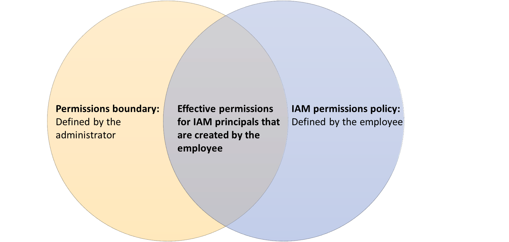

**IAM Role** - A role is an AWS identity with specific permissions. It can be assumed by trusted entities like AWS services,
IAM users, or applications. Using IAM roles, it is possible to access cross-account resources.

**IAM Permission Boundary** - A policy that sets the maximum permissions a user or role can have. 
It does not grant permissions but limits the permissions that can be granted by policies attached to the user or role.

