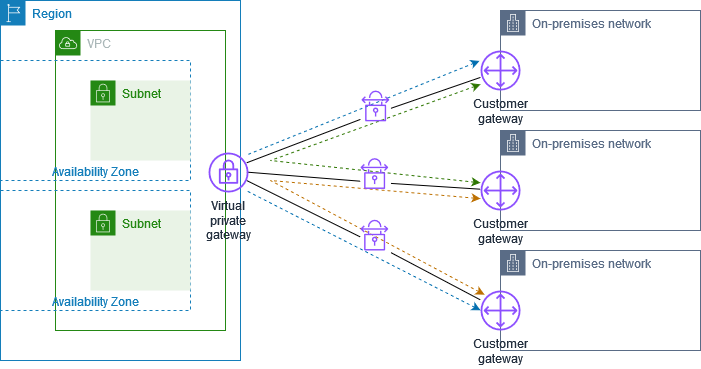

**VPC NAT Gateway** - A managed NAT service that allows instances in a private subnet in your VPC to access the 
internet (IPv4) while preventing inbound traffic from the internet.

**VPC NAT Instance** - An EC2 instance configured to perform NAT for instances in a private subnet. 
It requires manual management and scaling. NAT Gateway is preferred for production use due to its managed nature and scalability.
Full comparison: https://docs.aws.amazon.com/vpc/latest/userguide/vpc-nat-comparison.html

**VPN CloudHub** - A managed VPN service that allows you to connect your on-premises network to AWS using IPsec VPN connections.
If you have multiple AWS Site-to-Site VPN connections, you can provide secure communication between sites using the AWS VPN CloudHub.
This enables your sites to communicate with each other, and not just with the resources in your VPC. 
The VPN CloudHub operates on a simple hub-and-spoke model that you can use with or without a VPC. T
his design is suitable if you have multiple branch offices and existing internet connections and would like to implement a convenient,
potentially low-cost hub-and-spoke model for primary or backup connectivity between these sites.

**VPC Endpoint** - A VPC endpoint enables you to privately connect your VPC to supported AWS services and VPC endpoint services
powered by AWS PrivateLink without requiring an internet gateway, NAT device, VPN connection, or AWS Direct Connect connection.
Instances in your VPC do not require public IP addresses to communicate with resources in the service. AWS PrivateLink 
simplifies the security of data shared with cloud-based applications by eliminating the exposure of data to the public Internet.
When you use VPC endpoint, the traffic between your VPC and the other AWS service does not leave the Amazon network

**VPC Peering connection** - A VPC peering connection is a networking connection between two VPCs that enables you to route 
traffic between them using private IPv4 addresses or IPv6 addresses. Instances in either VPC can communicate with each other
as if they are within the same network. VPC peering facilitates a connection between two VPCs within the AWS network

**AWS Direct Connect** - networking service that provides an alternative to using the internet to connect to AWS. 
Using AWS Direct Connect, data that would have previously been transported over the internet is delivered through a private
network connection between your on-premises data center and AWS.
- Types of Direct Connect virtual interfaces:
  - **Private Virtual Interface**: Connects to a VPC using a private IP address.
  - **Public Virtual Interface**: Connects to AWS public services (like S3, DynamoDB) using public IP addresses.
  - **Transit Virtual Interface**: Used with AWS Transit Gateway for connecting multiple VPCs and on-premises networks.
