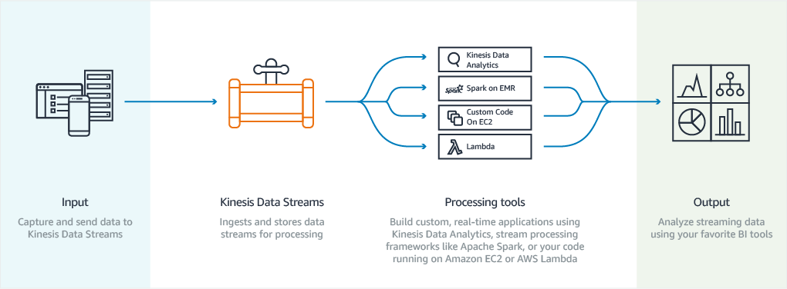
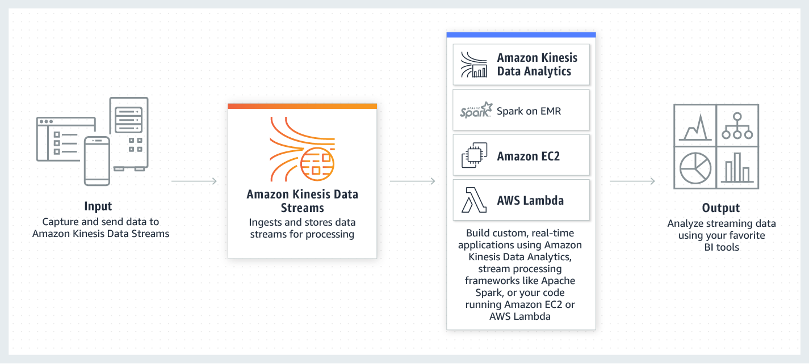
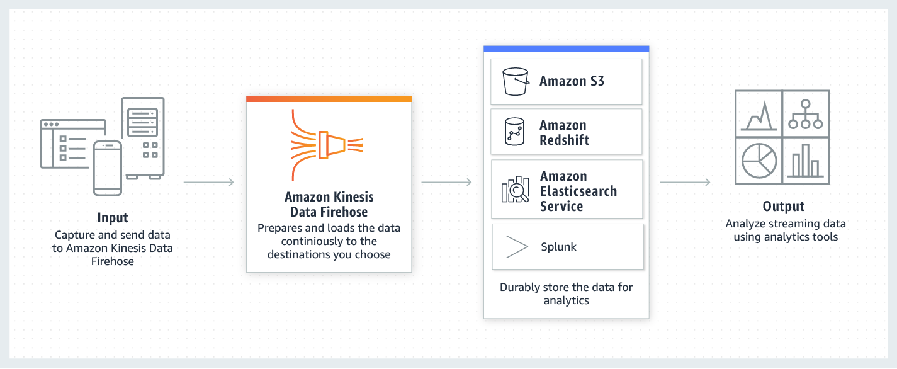
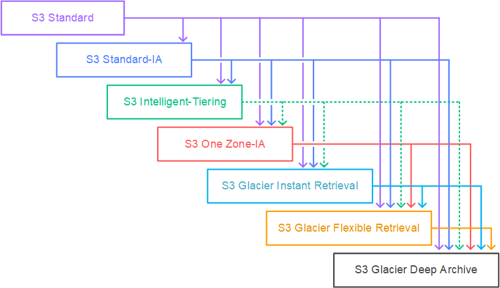
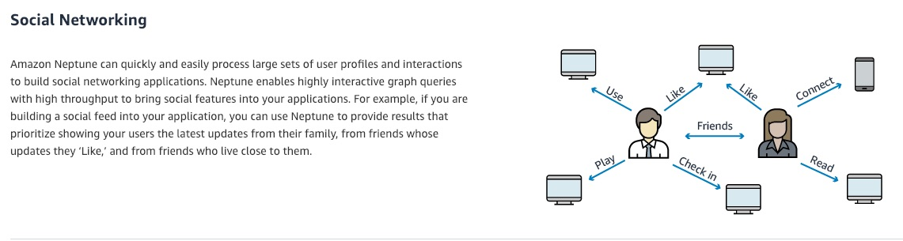
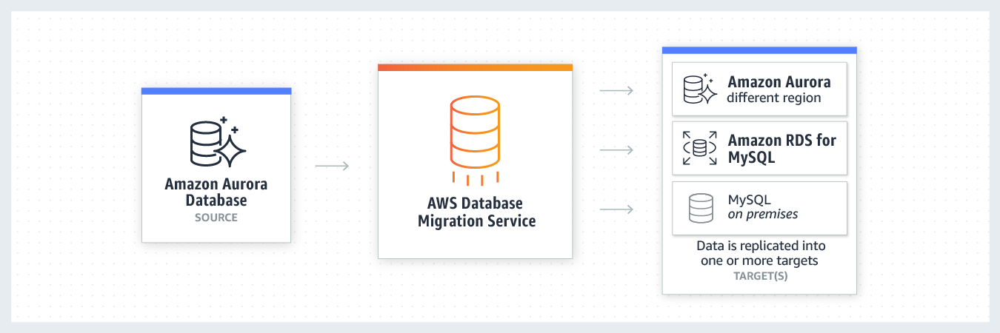
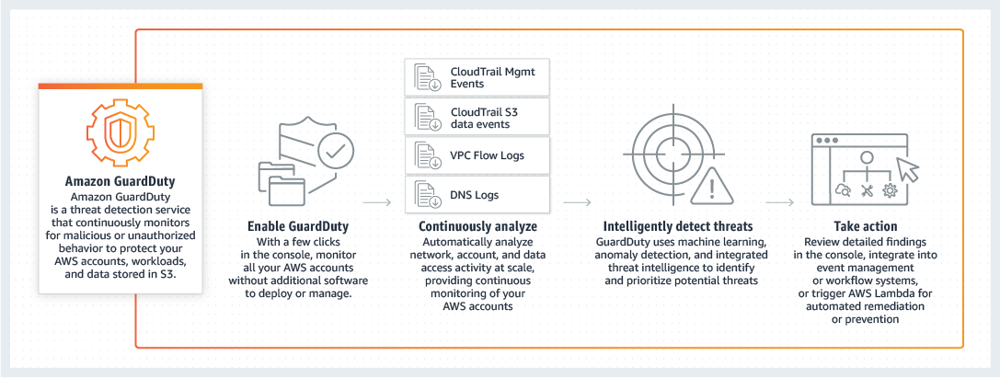
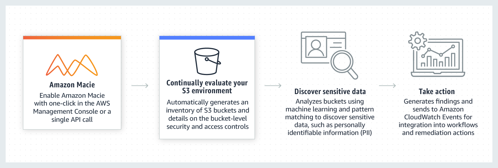

**Amazon CloudFront** - CDN, edges, caching, origin failover

**Amazon Global Accelerator** - Improve availability and performance globally. UDP, IoT (MQTT), Voice Over IP, HTTP. 
CloudFront is better for improving application resiliency to handle spikes in traffic.

**Amazon Aurora** - if the writer instance in a cluster with read replicas becomes unavailable, Aurora automatically 
promotes one of the reader instances to take place as a new writer. Up to 15 Replicas can be distributed across the Availability Zones (AZs)

**Amazon Kinesis Data Streams** - Amazon Kinesis Data Streams is useful for rapidly moving data off data producers and 
then continuously processing the data, be it to transform the data before emitting to a data store, run real-time metrics 
and analytics, or derive more complex data streams for further processing. Kinesis data streams can continuously capture 
gigabytes of data per second from hundreds of thousands of sources such as website clickstreams, database event streams, 
financial transactions, social media feeds, IT logs, and location-tracking events.
- **Enhanced Fan-Out** - With enhanced fan-out developers can register stream consumers to use enhanced fan-out and 
receive their own 2MB/second pipe of read throughput per shard, and this throughput automatically scales with the number of shards in a stream.

**Amazon Kinesis Data Firehose** - Amazon Kinesis Data Firehose is the easiest way to load streaming data into data stores 
and analytics tools. Kinesis Firehose cannot be used to process and analyze the streaming data in custom applications. 
It can capture, transform, and load streaming data into Amazon S3, Amazon Redshift, Amazon Elasticsearch Service, 
and Splunk, enabling near real-time analytics.

**Amazon S3 (Simple Storage Service)** - Object storage, data lake, static website hosting, versioning, lifecycle policies, cross-region replication,
S3 Glacier for archiving. Strong read-after-write consistency. Always returns the latest version of an object.
- **Amazon S3 Transfer Acceleration (Amazon S3TA)** - speeds up content uploads to S3 by routing traffic through the AWS global network.
- **Amazon multipart upload** - allows you to upload large objects in parts, improving upload speed and reliability. 
If object size is greater than 100 MB, multipart upload is recommended.
- Storage classes:
  - **S3 Standard** - General-purpose storage for frequently accessed data.
  - **S3 Intelligent-Tiering** - Automatically moves data between two access tiers when access patterns change.
  - **S3 Standard-IA (Infrequent Access)** - For long-lived but infrequently accessed data.
  - **S3 One Zone-IA** - Lower-cost option for infrequently accessed data that does not require multiple AZ resilience.
  - **S3 Glacier** - Low-cost storage for archival data with retrieval times ranging from minutes to hours.
  - **S3 Glacier Deep Archive** - Lowest-cost storage class for long-term archival data with retrieval times of up to 12 hours.
  

**Amazon EC2 (Elastic Compute Cloud)** - Virtual servers, auto-scaling, load balancing, security groups, EBS volumes.
Max 7 instances per AZ per group.

- Placement techniques for EC2 instances:
  - **Spread Placement** - Distributes instances across underlying hardware to reduce correlated failures.
  - **Cluster Placement** - Packs instances close together (inside AZ) for high throughput and low latency.
  - **Partition Placement** - Distributes instances across logical partitions to isolate failures.

- Root device types:
  - **EBS-backed** - Uses Amazon EBS volumes as root devices (Linux and Windows AMIs). Supports features like snapshots, 
  resizing, and encryption.
  - **Instance Store-backed** - Uses instance store volumes as root devices (Linux AMIs only). Provides temporary storage
- Dedicated Hosts and Dedicated Instances:
  - **Dedicated Host** - Physical server dedicated to your use, allowing you to run multiple instances on it. Useful for 
  compliance and licensing requirements.
  - **Dedicated Instance** - Instances that run on hardware dedicated to a single customer, but do not provide visibility into 
  the underlying host.
- A **launch template** is similar to a **launch configuration**, in that it specifies instance configuration information. 
  It includes the ID of the Amazon Machine Image (AMI), the instance type, a key pair, security groups, and other parameters 
  used to launch EC2 instances. However, defining a launch template instead of a launch configuration allows you to have 
- multiple versions of a launch template.

**Amazon EBS (Elastic Block Store)** - high-performance block storage service designed for use with EC2 for both throughput
and transaction-intensive workloads at any scale. By default, the root volume for an AMI backed by Amazon EBS is deleted
when the instance terminates. When you create an encrypted Amazon EBS volume and attach it to a supported instance type, 
data stored at rest on the volume, data moving between the volume and the instance, snapshots created from the volume and
volumes created from those snapshots are all encrypted. It uses AWS Key Management Service (AWS KMS) customer master keys (CMK)
when creating encrypted volumes and snapshots. Encryption operations occur on the servers that host Amazon EC2 instances,
ensuring the security of both data-at-rest and data-in-transit between an instance and its attached Amazon EBS storage.

**Amazon Aurora** - MySQL and PostgreSQL-compatible relational database built for the cloud, that combines 
the performance and availability of traditional enterprise databases with the simplicity and cost-effectiveness of open 
source databases. Amazon Aurora features a distributed, fault-tolerant, self-healing storage system that auto-scales up to 64 terabytes 
per database instance.
- **Amazon Aurora DB cluster** - An Amazon Aurora DB cluster consists of one or more DB instances and a cluster volume 
that manages the data for those DB instances.
  - **Primary (writer) DB instance** - Supports read and write operations, and performs all of the data modifications to the cluster volume. 
  Each Aurora DB cluster has one primary DB instance.
  - **Aurora Replica (reader DB instance)** – Connects to the same storage volume as the primary DB instance but supports only read operations.
  Each Aurora DB cluster can have up to 15 Aurora Replicas in addition to the primary DB instance.
- Types of Aurora Endpoints:
  - **Cluster endpoint** - The primary endpoint for the Aurora DB cluster. It connects to the primary DB instance.
  - **Reader endpoint** - A load-balanced endpoint that distributes connections to all available Aurora Replicas in the cluster.
  - **Custom endpoint** - Allows you to create a custom endpoint that connects to a specific set of instances in the cluster.

**Amazon DynamoDB** - NoSQL database, key-value and document store, global tables, on-demand capacity,  multi-region, 
multi-master, durable database with built-in security, backup and restore, and in-memory caching. 
- **DAX** is a DynamoDB-compatible caching service that enables you to benefit from fast in-memory performance for 
demanding applications. DAX does not support SQL query caching.

**Amazon Neptune** - Amazon Neptune is a fast, reliable, fully managed graph database service that makes it easy to build
and run applications that work with highly connected datasets. Amazon Neptune is highly available, with read replicas, 
point-in-time recovery, continuous backup to Amazon S3, and replication across Availability Zones. Neptune is secure with 
support for HTTPS encrypted client connections and encryption at rest.

**Amazon OpenSearch Service** - managed service that makes it easy for you to perform interactive log analytics, real-time
application monitoring, website search, and more. OpenSearch is an open source, distributed search and analytics suite derived from Elasticsearch.

**Amazon Redshift** - fully-managed petabyte-scale cloud-based data warehouse product designed for large scale data set 
storage and analysis. The given use-case is not about data warehousing, so this is not a correct option.

**AWS Database Migration Service** - helps you migrate databases to AWS quickly and securely. The source database remains fully
operational during the migration, minimizing downtime to applications that rely on the database. With AWS Database Migration Service,
you can continuously replicate your data with high availability and consolidate databases into a petabyte-scale data warehouse
by streaming data to Amazon Redshift and Amazon S3. 

**AWS Schema Conversion Tool (AWS SCT)** - tool to convert your existing database schema from one database engine to another.

**Amazon GuardDuty** - Threat detection service that continuously monitors for malicious activity and unauthorized behavior.
GuardDuty analyzes continuous streams of meta-data generated from your account and network activity found in AWS CloudTrail Events, 
Amazon VPC Flow Logs, and DNS Logs. It also uses integrated threat intelligence such as known malicious IP addresses, 
anomaly detection, and machine learning to identify threats more accurately. Review findings in the GuardDuty console,
or integrate into event management, workflow systems or trigger AWS Lambda.

**Amazon Macie** - Security service that uses machine learning and pattern matching to discover, classify, and protect 
sensitive data and PII in Amazon S3. Send results to Amazon CloudWatch Events for alerting and remediation.

**AWS Compute Optimizer** - Get recommendations to optimize the performance and cost of your AWS resources. EC2, EC2 Auto Scaling, and RDS

**Amazon FSx for Lustre** - fully managed service that provides high-performance, cost-effective, and scalable storage 
powered by Lustre, the world’s most popular high-performance file system. FSx for Lustre provides the fastest storage 
performance for GPU instances in the cloud with up to terabytes per second of throughput, millions of IOPS, sub-millisecond 
latencies, and virtually unlimited storage capacity. It delivers up to 34% better price performance compared to on-premises 
HDD file storage and up to 70% better price performance compared to other cloud-based Lustre storage. Use cases include
high-performance computing (HPC), machine learning, financial modeling, seismic reservoir simulations, and media data processing.

**Amazon FSx for Windows File Server** -  provides fully managed, highly reliable, and scalable file storage that is accessible
over the industry-standard Service Message Block (SMB) protocol. It is built on Windows Server, delivering a wide range of 
administrative features such as user quotas, end-user file restore, and Microsoft Active Directory (AD) integration.

**Amazon EMR** - industry-leading cloud big data platform for processing vast amounts of data using open 
source tools such as Apache Spark, Apache Hive, Apache HBase, Apache Flink, Apache Hudi, and Presto. Amazon EMR uses Hadoop,
an open-source framework, to distribute your data and processing across a resizable cluster of Amazon EC2 instances.
You can deploy your workloads to EMR using Amazon EC2, Amazon Elastic Kubernetes Service (EKS), or on-premises AWS Outposts.

**AWS Glue** - AWS Glue is a fully managed extract, transform, and load (ETL) service that makes it easy for customers to 
prepare and load their data for analytics. AWS Glue job is meant to be used for batch ETL data processing.

**AWS Elastic Beanstalk** - easy-to-use service for deploying and scaling web applications and services developed with Java,
.NET, PHP, Node.js, Python, Ruby, Go, and Docker on familiar servers such as Apache, Nginx, Passenger, and IIS.

You can simply upload your code and Elastic Beanstalk automatically handles the deployment, from capacity provisioning, 
load balancing, auto-scaling to application health monitoring. At the same time, you retain full control over the AWS resources
powering your application and can access the underlying resources at any time.

When you create an AWS Elastic Beanstalk environment, you can specify an Amazon Machine Image (AMI) to use instead of the
standard Elastic Beanstalk AMI included in your platform version. A custom AMI can improve provisioning times when instances
are launched in your environment if you need to install a lot of software that isn't included in the standard AMIs.

**Amazon Simple Notification Service (Amazon SNS)** - is a highly available, durable, secure, fully managed pub/sub messaging 
service that enables you to decouple microservices, distributed systems, and serverless applications. SNS cannot be used 
to decouple the producers and consumers for the real-time data processor as described in the given use-case.

**Amazon Simple Queue Service (Amazon SQS)** - offers a secure, durable, and available hosted queue that lets you integrate and
decouple distributed software systems and components. SQS cannot be used to decouple the producers and consumers for the 
real-time data processor as described in the given use-case.
