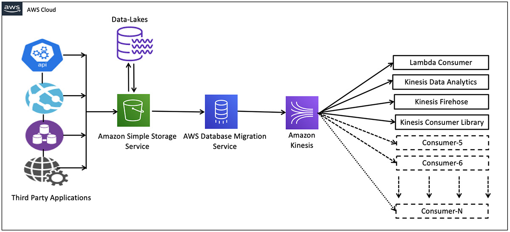
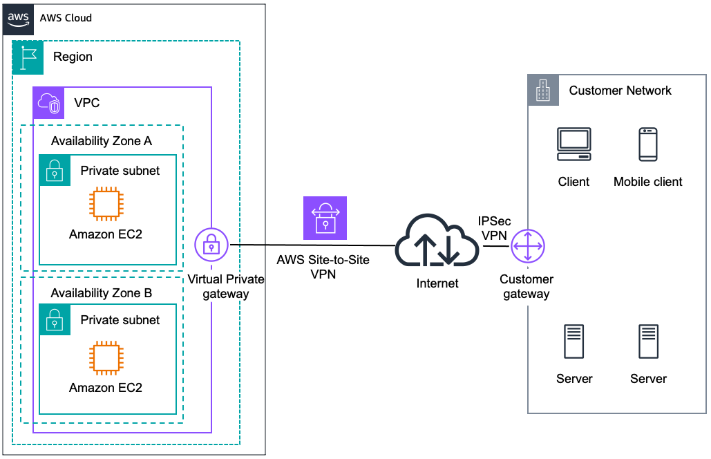

Leverage **AWS Database Migration Service (AWS DMS)** as a bridge between **Amazon S3** and **Amazon Kinesis Data Streams**

**Amazon VPC** provides the facility to create an IPsec VPN connection (also known as AWS site-to-site VPN) between remote customer networks and their Amazon VPC over the internet. The following are the key concepts for a site-to-site VPN:
- Virtual private gateway: A virtual private gateway (VGW), also known as a VPN Gateway is the endpoint on the AWS VPC side of your VPN connection.
- VPN connection: A secure connection between your on-premises equipment and your VPCs.
- VPN tunnel: An encrypted link where data can pass from the customer network to or from AWS.
- Customer Gateway: An AWS resource that provides information to AWS about your Customer Gateway device.
- Customer Gateway device: A physical device or software application on the customer side of the Site-to-Site VPN connection.

